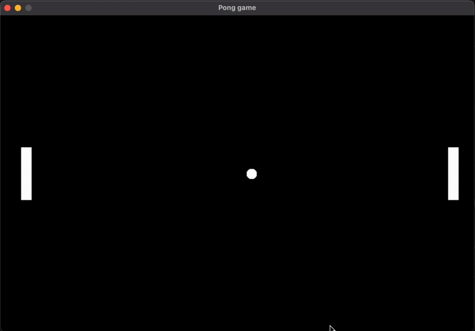

# Pong Clone (SDL2 + SDL\_ttf)

A simple two–player Pong clone in C using **SDL2** and **SDL\_ttf**, with a basic victory screen. 

---

# Demo




---

## 1. Requirements

### macOS (Homebrew)

Install / update Homebrew (if you do not already have it):

```bash
/bin/bash -c "$(curl -fsSL https://raw.githubusercontent.com/Homebrew/install/HEAD/install.sh)"
```

Install libraries:

```bash
brew install sdl2 sdl2_ttf
```

### Linux (Debian / Ubuntu / Mint)

```bash
sudo apt update
sudo apt install build-essential libsdl2-dev libsdl2-ttf-dev
```

### Linux (Fedora / RHEL / Alma / Rocky)

```bash
sudo dnf install @development-tools SDL2-devel SDL2_ttf-devel
```

### Windows (MSYS2)

1. Install MSYS2: [https://www.msys2.org/](https://www.msys2.org/)
2. Open **MSYS2 MINGW64** shell and run:

```bash
pacman -Syu            # update, restart shell if asked
pacman -S mingw-w64-x86_64-gcc mingw-w64-x86_64-SDL2 mingw-w64-x86_64-SDL2_ttf
```

You will compile inside that MINGW64 shell.

> **Font file**: Place any `.ttf` or `.otf` you want (e.g. `FreeSansBold.otf` or `DejaVuSans-Bold.ttf`) in the same directory as the executable or use an absolute path.

---

## 2. Build (Compilation)

Put your source file (e.g. `pong.c`) in a folder, plus the font file.

### macOS (clang + Homebrew paths)

```bash
clang pong.c -I"$(brew --prefix)/include" -L"$(brew --prefix)/lib" \
  -lSDL2 -lSDL2_ttf -lm -o pong
```

### Linux (GCC)

```bash
gcc pong.c -lSDL2 -lSDL2_ttf -lm -o pong
```

(If the linker complains, add `-pthread`.)

### Windows (MSYS2 / MINGW64)

```bash
gcc pong.c -lSDL2 -lSDL2_ttf -lm -o pong.exe
```

If headers / libs are not found, add `-I/mingw64/include -L/mingw64/lib`.

Run:

```bash
./pong       # or ./pong.exe on Windows
```

Controls: Left player **W/S**, Right player **O/L**. After a win: **R** to restart, **Esc** to quit.

---

## 3. Deep Dive Into the Code

### 3.1 Constants & Types

```c
#define WIDTH 900
#define HEIGHT 600
#define MOVEMENT 200.0      // paddle speed (pixels per second)
#define BALL_MOVEMENT 350.0 // initial horizontal ball speed
#define COLOR_BLACK 0xFF000000 // ARGB packed color for clearing the surface
#define MAX_ANGLE 0.509        // ≈29 degrees max deflection angle
```

Why `MAX_ANGLE`? It limits how steep (vertical) a bounce can be. If you raise it (e.g. 1.0 or 1.3 radians), rallies become more varied.

```c
typedef struct { double x, y, r; double vy, vx; } Circle;   // Ball
typedef struct { double x, y; } Wall;                       // Paddle (top-left)

typedef enum { PLAYING, GAME_OVER } GameState;              // Simple state machine
```

We store velocity components (`vx`, `vy`) instead of speed+angle so updates are simple.

### 3.2 Drawing Helpers

#### `FillQuad`

```c
static void FillQuad(SDL_Surface *s, Wall w, Uint32 color) {
    if (SDL_MUSTLOCK(s)) SDL_LockSurface(s);
    SDL_Rect rect = { (int)w.x, (int)w.y, 20, 100 };
    SDL_FillRect(s, &rect, color);
    if (SDL_MUSTLOCK(s)) SDL_UnlockSurface(s);
}
```

*Locks* the surface if needed, fills a 20×100 rectangle for the paddle. Width/height are hard‑coded here (quick and dirty). For maintainability you could add `#define PADDLE_W 20`, `#define PADDLE_H 100`.

#### `FillCircle`

```c
static void FillCircle(SDL_Surface *s, Circle c, Uint32 color) {
    double r2 = c.r * c.r;
    if (SDL_MUSTLOCK(s)) SDL_LockSurface(s);
    for (double px = c.x - c.r; px <= c.x + c.r; ++px)
        for (double py = c.y - c.r; py <= c.y + c.r; ++py)
            if ((px - c.x)*(px - c.x) + (py - c.y)*(py - c.y) < r2) {
                SDL_Rect dot = { (int)px, (int)py, 1, 1 };
                SDL_FillRect(s, &dot, color);
            }
    if (SDL_MUSTLOCK(s)) SDL_UnlockSurface(s);
}
```

A brute‑force pixel fill: loops over the square bounding the circle and tests the distance to center. For larger radii or many circles you’d optimize (e.g. midpoint circle algorithm), but for a single 10‑px ball this is fine.

### 3.3 Paddle Movement

```c
static inline void moveDown(Wall *w, double dt) {
    w->y += MOVEMENT * dt;
    if (w->y + 100 > HEIGHT) w->y = HEIGHT - 100;
}
static inline void moveUp(Wall *w, double dt) {
    w->y -= MOVEMENT * dt;
    if (w->y < 0) w->y = 0;
}
```

Uses frame‑independent motion (`dt` = seconds since last frame). Clamps inside window bounds.

### 3.4 Ball Update & Wall Bounce

```c
static inline void updateBallPosition(Circle *c, double dt) {
    c->x += c->vx * dt;
    c->y += c->vy * dt;

    if (c->y - c->r < 0) {          // top wall
        c->y = c->r;                 // reposition to avoid sticking
        c->vy = -c->vy;              // invert vertical velocity
    }
    if (c->y + c->r > HEIGHT) {     // bottom wall
        c->y = HEIGHT - c->r;
        c->vy = -c->vy;
    }
}
```

We update position first, then respond to boundary collisions by reflecting `vy` and clamping the position so the ball does not "sink" past the wall.

### 3.5 Paddle Collision & Angle Calculation

```c
static void checkCollision(Circle *c, Wall *L, Wall *R) {
    // Left paddle
    if (c->x - c->r <= L->x + 20 && c->x + c->r >= L->x &&
        c->y + c->r >= L->y      && c->y - c->r <= L->y + 100) {
        double offset = (c->y - (L->y + 50.0)) / 50.0; // center-normalized (-1..1)
        offset = fmax(-1.0, fmin(1.0, offset));
        double angle = offset * MAX_ANGLE;
        double speed = hypot(c->vx, c->vy);            // preserve total speed
        c->vx =  speed * cos(angle);                   // always to the right
        c->vy =  speed * sin(angle);
    }
    // Right paddle
    else if (c->x + c->r >= R->x && c->x - c->r <= R->x + 20 &&
             c->y + c->r >= R->y && c->y - c->r <= R->y + 100) {
        double offset = (c->y - (R->y + 50.0)) / 50.0;
        offset = fmax(-1.0, fmin(1.0, offset));
        double angle = offset * MAX_ANGLE;
        double speed = hypot(c->vx, c->vy);
        c->vx = -speed * cos(angle);                   // to the left
        c->vy =  speed * sin(angle);
    }
}
```

**Key idea:** The vertical deflection is proportional to *where* the ball hits relative to the paddle’s center. Hit near the top → negative offset → negative angle (ball goes upward). Hit near center → `offset ≈ 0` → angle ≈ 0 (horizontal). By recomputing `(vx, vy)` from a fixed speed we keep gameplay consistent.

### 3.6 Reset Logic

```c
static void resetGame(Circle *c, Wall *L, Wall *R) {
    c->x = WIDTH / 2.0; c->y = HEIGHT / 2.0;
    c->vx = BALL_MOVEMENT; c->vy = 0.0;
    L->y = R->y = (HEIGHT - 100) / 2.0;
}
```

Called when restarting after a win. It recenters ball & paddles and gives the ball an initial rightward velocity.

### 3.7 Main Loop Structure

Pseudo-outline of the core loop:

```c
while (running) {
    // 1. Poll SDL events (quit, keydown during GAME_OVER)
    // 2. Compute dt from SDL_GetTicks()
    if (state == PLAYING) {
        // 3. Read keyboard state each frame (continuous movement)
        // 4. Update paddles
        // 5. Update ball position
        // 6. Check collisions (paddles)
        // 7. If ball passes left/right edge -> set GAME_OVER + winner
    }
    // 8. Clear surface
    // 9. Render either game scene or victory text
    // 10. Update window surface
    // 11. Delay ~16ms (rough 60 FPS cap)
}
```

Notes:

* Using the *state machine* avoids immediately exiting; instead we draw a victory screen.
* We query continuous key state with `SDL_GetKeyboardState` rather than relying on discrete key events, ensuring smooth paddle motion.

### 3.8 Victory Screen Rendering

Excerpt inside the render section when `state == GAME_OVER`:

```c
const char *msg = (winner == -1) ? "LEFT PLAYER WINS!" : "RIGHT PLAYER WINS!";
SDL_Color white = {255,255,255,255};
SDL_Surface *text = TTF_RenderUTF8_Blended(font, msg, white);
SDL_Rect dst = { (WIDTH - text->w)/2, (HEIGHT - text->h)/2, text->w, text->h };
SDL_BlitSurface(text, NULL, surf, &dst);
SDL_FreeSurface(text);

SDL_Surface *hint = TTF_RenderUTF8_Blended(font, "Press R to restart — Esc to quit", white);
dst.x = (WIDTH - hint->w)/2; dst.y = HEIGHT/2 + text->h; // place below main message
SDL_BlitSurface(hint, NULL, surf, &dst);
SDL_FreeSurface(hint);
```

`TTF_RenderUTF8_Blended` creates a temporary surface containing the glyphs; we blit it, then free it immediately to avoid leaks.

### 3.9 Timing (`dt`)

```c
Uint32 now = SDL_GetTicks();
double dt = (now - prev) / 1000.0; // milliseconds → seconds
prev = now;
```

Multiplying movement by `dt` makes gameplay independent of frame rate: if a frame temporarily takes longer, movement still approximates real time.

---

## 4. Key Concepts Recap

| Concept                     | Why it Matters                                   | Where Implemented                       |
| --------------------------- | ------------------------------------------------ | --------------------------------------- |
| Delta time (`dt`)           | Frame-rate independent motion                    | Main loop (`now - prev`)                |
| Normalized impact offset    | Angle variation based on hit point               | `checkCollision`                        |
| Fixed max bounce angle      | Prevents near-vertical loops                     | `MAX_ANGLE` constant                    |
| State machine               | Allows victory screen, restart                   | `GameState` enum + `state` logic        |
| Immediate surface drawing   | Quick & simple (no renderer/texture boilerplate) | All drawing helpers                     |
| Recomputing velocity vector | Keeps speed constant after bounce                | `checkCollision`                        |
| Clamping positions          | Avoids objects escaping playfield                | `moveUp/moveDown`, `updateBallPosition` |