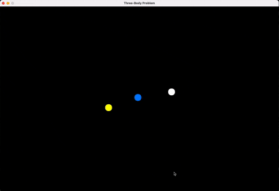

# Three‑Body Problem Simulation

A real‑time visualisation of the famous planar **figure‑8 three‑body orbit**. The program integrates Newtonian gravity with a **leapfrog (velocity‑Verlet) scheme**, recenters the camera on the instantaneous centre of mass, and leaves colourful trails behind each body.

---

# Demo



## 1. Quick Start

### Build (Linux / macOS)

```bash
cc 3_body.c -lm -lSDL2 -o 3_body
```

> Requires the SDL2 development package (`libsdl2-dev` on Debian/Ubuntu, `brew install sdl2` on macOS).

### Run

```bash
./3_body
```

A window **1200 × 800** opens; three coloured blobs chase each other in a repeating figure‑8. Close the window or press the close button to quit.

---

## 2. Key Features

| Feature                         | Detail                                                                                       |
| ------------------------------- | -------------------------------------------------------------------------------------------- |
| **Order‑4 Leapfrog Integrator** | Time‑reversible, symplectic; good energy behaviour.                                          |
| **Figure‑8 Initial Condition**  | Uses the well‑known equal‑mass periodic orbit (Chenciner & Montgomery, 2000).                |
| **Adaptive Frame Timing**       | Physics time‑step `FIXED_DT = 2 × 10⁻⁴ s`; real‑time frames accumulate leftover time.        |
| **Centre‑of‑Mass Re‑centering** | Keeps the dance centred in the window regardless of momentum drift.                          |
| **Trail Buffer per Body**       | Circular buffer (`TRAIL_BUF = 5000`) with min‑distance filter to avoid over‑plotting points. |
| **Pure SDL Surface Drawing**    | No hardware renderer, just pixel‑fills; portable and simple.                                 |

---

## 3. Code Tour

### 3.1 Configuration Macros

```c
#define WIDTH  1200
#define HEIGHT  800
#define NUM_BODIES 3
#define G 10000.0          // Gravitational constant (scaled for simulation)
#define FIXED_DT 0.0002    // Physics step (seconds)
```

* Screen size can be changed; physics scale is arbitrary (pixels ≈ distance units).
* `G` is tuned so the figure‑8 fits nicely inside the window.

### 3.2 `Planet` & `Trail` Structs

```c
typedef struct {
    double x, y;      // position (px)
    double vx, vy;    // velocity (px/s)
    double mass;      // mass (arbitrary units)
    double r;         // radius when drawn (px)
} Planet;

typedef struct {
    int x[TRAIL_BUF]; // circular arrays of pixel coords
    int y[TRAIL_BUF];
    int head;         // next write position
    int size;         // current valid points
} Trail;
```

* Trails store integers to keep memory small and drawing fast.
* `MIN_DIST = 1.5` px avoids redundant successive points.

### 3.3 Drawing Helpers

* **`fill_circle`**: brute‑force pixel fill inside `r² = x²+y²` (good enough for small radii).
* **`trail_push`**: append point if moved ≥ `MIN_DIST` from last.
* **`trail_draw`**: draws from newest to oldest (optional; ordering doesn’t matter visually).

### 3.4 Physics – Leapfrog Step

```c
// 1. Half‑kick
vx += 0.5·a·dt
// 2. Drift
x  += vx·dt
// 3. Recompute accelerations (new positions)
// 4. Another half‑kick
vx += 0.5·a·dt
```

* `accelerations()` computes pairwise forces with softened denominator (`+ EPSILON`) to avoid singularities.
* Arrays `ax[]`, `ay[]` are static to avoid realloc each frame.

### 3.5 Camera Recentering

```c
cx = Σ mᵢ xᵢ / Σ mᵢ;
cy = Σ mᵢ yᵢ / Σ mᵢ;
dx = WIDTH/2 - cx;  // shift so CoM at centre
for each body: xᵢ += dx, yᵢ += dy;
```

Keeps the system onscreen even if numerical drift introduces net momentum.

---

## 4. Controls & Interaction

There are no interactive controls in this minimal build—close the window to exit. You can easily add:

| Key     | Action                             |
| ------- | ---------------------------------- |
| **P**   | Pause/unpause integration          |
| **R**   | Reset to initial condition         |
| **↑/↓** | Increase/decrease simulation speed |

---

## 5. Performance Notes

* **CPU only**: Each frame touches \~`NUM_BODIES²` force pairs (here 3 → 3 pairs). Even with hundreds of bodies, leapfrog + simple force loop is fine.
* **Trail cost**: drawing `TRAIL_BUF × NUM_BODIES` 2×2 px rects each frame; negligible.
* Main cost is **full‑surface clear** (`SDL_FillRect`) each frame. Switch to SDL renderer/textures for hardware acceleration if needed.