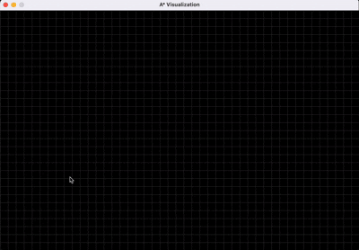

# A* Pathfinding Algorithm Visualization

## Overview
This program is an interactive visualization of the A* pathfinding algorithm using SDL2. It allows users to create obstacles, set start and end points, and visualize the algorithm's process of finding the shortest path in real-time.

# Demo



## Features
- **Grid-based environment** with customizable cells
- **Interactive placement** of start point, end point, and walls
- **Real-time visualization** of the algorithm's search process
- **Path reconstruction** showing the final optimal path
- **Reset functionality** to clear the grid

## Code Explanation

### 1. Preprocessor Definitions and Structures
```c
#define WIDTH 900       // Window width
#define HEIGHT 600      // Window height
#define CELL_SIZE 20    // Size of each grid cell
#define ROWS HEIGHT / CELL_SIZE  // Number of rows in grid
#define COLUMNS WIDTH / CELL_SIZE // Number of columns in grid

struct Cell {
    int x, y;           // Grid coordinates
    int type;            // Cell type (0=empty, 1=source, 2=goal, 3=wall, etc.)
};
```

### 2. Core Functions

**Grid Management:**
- `initialize_environment()`: Sets up the initial grid with all empty cells
- `get_index()`: Converts 2D grid coordinates to 1D array index
- `in_bounds()`: Checks if coordinates are within grid boundaries

**Rendering:**
- `draw_grid()`: Draws the grid lines
- `draw_cell()`: Renders a single cell
- `draw_environment()`: Draws all cells based on their type

**A* Algorithm:**
```c
void a_star(struct Cell world[], int source_index, int goal_index, ...)
```
1. Initializes data structures:
   - `g_score`: Cost from start to current cell
   - `f_score`: Estimated total cost (g_score + heuristic)
   - `came_from`: Tracks optimal path
   - `open_set`/`closed_set`: Tracks visited cells

2. Main loop:
   - Selects cell with lowest f_score from open set
   - Processes neighbors (4-direction movement)
   - Updates scores and sets if better path found
   - Visualizes open/closed sets in real-time

3. Path reconstruction:
   - Traces back from goal to start using came_from
   - Visualizes final path

### 3. Main Program Flow
1. **Initialization:**
   - Create SDL window and surface
   - Initialize grid world

2. **Event Handling:**
   - **Keyboard Controls:**
     - `S`: Set source (start) point
     - `G`: Set goal (end) point
     - `W`: Place walls
     - `R`: Reset grid
     - Space: Run A* algorithm
   
   - **Mouse Controls:**
     - Left click: Place selected cell type
     - Click+drag: Draw walls

3. **Rendering Loop:**
   - Continuously draws grid and cells
   - Updates display at 100 FPS (10ms delay)

## How to Use
1. **Set Start/End Points:**
   - Press `S` then click to place start point (yellow)
   - Press `G` then click to place end point (blue)

2. **Create Obstacles:**
   - Press `W` then click/drag to place walls (gray)

3. **Run Algorithm:**
   - Press Spacebar to execute A*

4. **Reset:**
   - Press `R` to clear all paths and obstacles

## Visualization Colors
| Color       | Meaning          |
|-------------|------------------|
| Yellow      | Start point      |
| Blue        | End point        |
| Gray        | Wall/Obstacle    |
| Green       | Open set         |
| Red         | Closed set       |
| White       | Optimal path     |
| Black       | Empty space      |

## Algorithm Characteristics
- Uses **Manhattan distance** as heuristic
- Explores cells in 4 directions (up/down/left/right)
- Visualizes exploration process in real-time
- Shows final optimal path in white

## Compilation and Execution
Compile with:
```bash
gcc a_star.c -o _astar -lSDL2
```

Run with:
```bash
./a_star
```

The visualization helps understand how A* efficiently searches for the shortest path while avoiding obstacles, balancing between Dijkstra's thoroughness and greedy best-first search's speed.