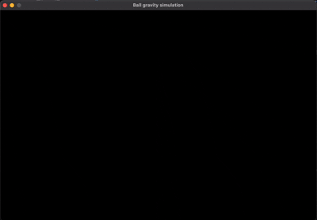

# 2D Gravity & Collision Sandbox (SDL2, C)

An **interactive particle sandbox**: left–click to continuously spawn blue balls affected by gravity; right–click to place white square obstacles (“quads”). Balls fall, collide with each other (elastic-ish with restitution), bounce on walls/floor, and resolve penetration against obstacles.

---

## Table of Contents

1. [High‑Level Overview](#high-level-overview)
2. [Constants & Tunable Parameters](#constants--tunable-parameters)
3. [Core Data Structures](#core-data-structures)
4. [Dynamic Array Management](#dynamic-array-management)
5. [Rendering Helpers](#rendering-helpers)
6. [Physics Update Pipeline](#physics-update-pipeline)
7. [Circle–Quad Collision Resolution](#circlequad-collision-resolution)
8. [Circle–Circle Collision Resolution](#circlecircle-collision-resolution)
9. [Event Handling & Spawning Logic](#event-handling--spawning-logic)
10. [Main Loop Execution Order](#main-loop-execution-order)
11. [Precision, Stability & Edge Cases](#precision-stability--edge-cases)
12. [Quick Reference Cheat Sheet](#quick-reference-cheat-sheet)

---

# Demo



## 1. High‑Level Overview

The program uses **SDL2** in *software surface* mode:

* One window + its `SDL_Surface` as a pixel buffer.
* A variable‐time physics step (frame Δt computed from `SDL_GetTicks`).
* Simple *impulse* based collision handling for circle–circle and a *project–then–reflect* method for circle–axis‑aligned square.
* Continuous spawning while mouse buttons are held by accumulating time (`spawn_ball_accum`, `spawn_wall_accum`).

Execution loop each frame:

1. Poll all pending SDL events.
2. Possibly spawn new dynamic objects (circles / quads) depending on mouse state and time accumulator.
3. Integrate motion (gravity + velocities) for each circle.
4. Resolve circle vs quad penetrations (positional correction + velocity reflection).
5. Resolve circle vs world bounds (floor & side walls).
6. Resolve circle vs circle contacts (pairwise elastic response).
7. Clear screen + redraw everything.
8. Present and delay a little.

---

## 2. Constants & Tunable Parameters

| Name                                 | Meaning                                                                   | Notes / Effects                                                     |
| ------------------------------------ | ------------------------------------------------------------------------- | ------------------------------------------------------------------- |
| `WIDTH`, `HEIGHT`                    | Window size in pixels                                                     | World coordinate system is 1:1 with pixels.                         |
| `GRAVITY`                            | Downward acceleration (px/s²)                                             | Larger = faster falls; affects bounce energy visually.              |
| `REST_SIDE`                          | Restitution for collisions with *side* boundaries & quads (indirectly)    | 1.0 would be perfectly elastic; here 0.7 loses 30% normal velocity. |
| `REST_BALL`                          | Restitution for circle–circle collisions                                  | 0.6 means 60% of normal relative speed retained after impact.       |
| Radii (`r = 10` for circles / quads) | Both circles and quads use a scalar `r` (for quads it's half side length) | Makes squares 20×20; easy symmetric math.                           |
| `spawn_interval`                     | Minimum time between spawn events while holding the mouse                 | Controls spawning rate.                                             |

Changing these allows quick experimentation with *feel* (e.g. raising `REST_BALL` yields bouncier balls).

---

## 3. Core Data Structures

### `Circle`

```c
typedef struct {
    double x, y;   // center position in pixels
    double r;      // radius
    double vy;     // vertical velocity (px/s)
    double vx;     // horizontal velocity (px/s)
} Circle;
```

A minimalist physics body (no mass field; all masses implicitly 1). The coordinate system origin is top‑left (SDL convention), Y increases downward.

### `Quad`

```c
typedef struct {
    double x, y;   // center position
    double r;      // half side length (so full side = r*2)
} Quad;
```

Axis-aligned square obstacles. Using a single `r` simplifies generating bounding edges: left = x - r, right = x + r, etc.

### Dynamic Arrays

`CircleArray` & `QuadArray` wrap raw pointers + bookkeeping for a resizable vector pattern.

```c
typedef struct { Circle *array; size_t used, size; } CircleArray;
```

* `used`: current count.
* `size`: allocated capacity.
* Doubling strategy on overflow for amortized O(1) insertion.

---

## 4. Dynamic Array Management

#### Initialization

```c
void initCircleArray(CircleArray *a, size_t initialSize) {
    a->array = malloc(initialSize * sizeof(Circle));
    a->used = 0; a->size = initialSize;
}
```

No zero‑fill required since each element is explicitly set when inserted.

#### Insertion

```c
if (a->used == a->size) { a->size *= 2; a->array = realloc(...); }
a->array[a->used++] = c;
```

Potential failure is checked (`tmp`); if `realloc` fails the old array remains valid.

#### Free

Resets pointer and counters to avoid dangling usage.

**Edge case:** Out‑of-memory path logs error but *does not abort*; subsequent logic may attempt to insert anyway (acceptable for a simple demo).

---

## 5. Rendering Helpers

The renderer plots directly into the window surface (software).

### `FillCircle`

1. Compute integer bounding box of the circle.
2. Lock surface if needed.
3. Iterate each pixel in bounding box; test `(dx*dx + dy*dy) <= r²`.
4. If inside, write `Uint32` color directly (format‑correct because surface pixel format used via `SDL_MapRGB` earlier).
5. Unlock if locked.

This is O(r²) per circle. For many circles performance could degrade (see improvements section).

### `FillQuad`

Wraps `SDL_FillRect`, building a `SDL_Rect` from center/half‑size convention.

---

## 6. Physics Update Pipeline

For each circle *before* collision resolution:

```c
vy += GRAVITY * dt;  // acceleration integration (Euler)
y  += vy * dt;
// vx path currently zero (placeholder for future forces)
x  += vx * dt;
```

Integration method: **semi‑implicit (symplectic) Euler** for vertical axis (velocity updated, then position). Adequate for arcade feel, though not highly accurate for stiff systems.

### Coordinate & Units

* Positions & velocities: double precision (helps reduce cumulative float drift for long runtimes).
* `dt`: seconds (`ms / 1000.0`).

---

## 7. Circle–Quad Collision Resolution

Function: `resolveCircleQuad(Circle *c, const Quad *q)`

1. **Compute rectangle bounds** from quad center + half side:

   ```c
   left = q->x - q->r; right = q->x + q->r; top = q->y - q->r; bottom = q->y + q->r;
   ```
2. **Find closest point** on the rectangle to circle center (clamp):

   ```c
   closestX = clamp(c->x, left, right);
   closestY = clamp(c->y, top, bottom);
   ```
3. **Vector from closest point to center** gives penetration context: `dx, dy`.
4. If `dist² > r²` → no overlap, return.
5. If distance > epsilon: compute normalized collision normal `(nx, ny)` and positional correction:

   ```c
   penetration = r - dist; c->x += nx * penetration; c->y += ny * penetration;
   ```
6. **Special case dist ≈ 0**: circle center is *inside* or exactly at a corner — choose the minimal distance edge and push outward along that axis to avoid NaNs (normal becomes axis unit vector).
7. **Velocity reflection**: compute normal component `vn = vx*nx + vy*ny`. If `vn < 0` (approaching): apply restitution impulse:

   ```c
   bounce = -(1 + REST_SIDE) * vn;
   vx += nx * bounce; vy += ny * bounce;
   ```

   This mirrors the normal component and scales it by restitution.

---

## 8. Circle–Circle Collision Resolution

Nested loops (`k` outer, `j` inner) iterate unordered unique pairs (`j = k + 1`). For each pair:

1. Compute separation vector:

   ```c
   dx = x_j - x_k; dy = y_j - y_k; dist2 = dx*dx + dy*dy; minDist = r_i + r_j;
   if (dist2 >= minDist*minDist) continue; // no contact
   ```
2. **Distance & Normal**:

   * If `dist > 0`: normalize `nx = dx/dist`, `ny = dy/dist`.
   * If `dist == 0` (centers coincident): choose arbitrary normal (1,0) to avoid division by zero.
3. **Positional Correction (Symmetric)**:

   ```c
   penetration = minDist - dist; half = penetration * 0.5;
   pos_k -= normal * half; pos_j += normal * half;
   ```

   Splits correction equally (equal “mass”).
4. **Relative Velocity Along Normal**:

   ```c
   rvx = vx_j - vx_k; rvy = vy_j - vy_k; vn = rvx*nx + rvy*ny;
   if (vn > 0) continue; // already separating
   ```
5. **Impulse Magnitude** (equal mass, restitution):

   ```c
   jimp = -(1 + REST_BALL) * vn / 2; // since 1/m1 + 1/m2 = 2
   ```
6. **Apply Impulse**:

   ```c
   vx_k -= jimp * nx; vy_k -= jimp * ny; vx_j += jimp * nx; vy_j += jimp * ny;
   ```

**Why divide by 2?** For equal masses m=1, impulse distribution formula reduces; each velocity changes proportionally.

---

## 9. Event Handling & Spawning Logic

SDL events are processed in a loop *before* physics each frame. Important states:

* `mouseDown` (left button held) ⇒ spawn circles.
* `wall` (right button held) ⇒ spawn quads.

### Continuous Spawn via Accumulators

Each frame adds `dt` to `spawn_ball_accum` while active. While `spawn_ball_accum >= spawn_interval` it *emits* one object and subtracts `spawn_interval`. This decouples spawning rate from frame rate (if frame is long, may spawn multiple to “catch up”).

### Immediate Single Spawn

At the initial `MOUSEBUTTONDOWN` event, a first object is inserted instantly (responsive feedback) *before* the time‑driven spawner adds more.

---

## 10. Main Loop Execution Order

Pseudo‑flow:

```text
while running:
  dt = frame_time()
  handle_events_and_spawning()
  integrate_circles(dt)
  clear_screen()
  resolve_circle_quad_collisions()
  draw_quads()
  resolve_circle_circle_collisions() + draw_circles()
  draw + boundary collision adjustments (floor / walls)
  update_window_surface()
  delay(10ms)
```

(Actual code intermixes some drawing & collision; could be refactored to strictly: integrate → resolve all collisions → draw.)

**Note:** Circle–circle collision loop currently *inside* a per‑circle drawing loop; logically this nests an extra loop, making complexity roughly O(n³) in worst case because it repeats pairwise loop for each `i`. A recommended refactor is to separate collision resolution from rendering (see improvements).

---

## 11. Precision, Stability & Edge Cases

| Issue                            | Current Handling                   | Potential Risk                   | Improvement                                  |
| -------------------------------- | ---------------------------------- | -------------------------------- | -------------------------------------------- |
| Variable `dt`                    | Direct Euler integration           | Large frame → tunneling          | Cap max `dt` (e.g., clamp to 1/60s \* k)     |
| Circle inside quad (dist=0)      | Heuristic push toward nearest side | Could jitter if exactly centered | Cache previous normal or random small offset |
| Multiple collisions in one frame | Single pass                        | Residual small overlaps          | Iterate until no overlaps or limit passes    |
| Pairwise O(n²)/O(n³)             | Brute force                        | Slow for thousands               | Spatial hashing / uniform grid / quadtree    |
| Energy gain/loss                 | Restitution constants              | Unrealistic combos               | Track and clamp velocity magnitudes          |

---

## 12. Quick Reference Cheat Sheet

| Concept                          | Formula / Snippet                                       |
| -------------------------------- | ------------------------------------------------------- |
| Gravity integration              | `vy += g*dt; y += vy*dt;`                               |
| Clamp function                   | `clamped = x < a ? a : (x > b ? b : x);`                |
| Circle–circle normal             | `nx = dx/dist; ny = dy/dist;`                           |
| Penetration correction           | `posA -= n*(penetr/2); posB += n*(penetr/2);`           |
| Restitution impulse (equal mass) | `j = -(1+e) * vn / 2;`                                  |
| Reflect velocity on normal       | `v' = v - (1+e)(v·n)n` (expanded in code)               |
| Spawn rate                       | emit while `accum >= interval` then `accum -= interval` |