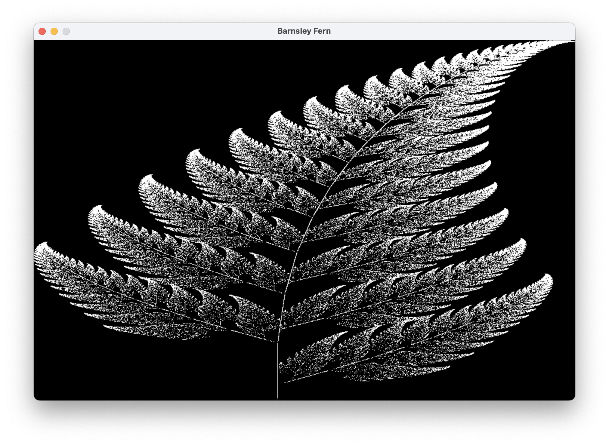

# Barnsley Fern

A program that renders the classic **Barnsley Fern fractal** using SDL2. It applies four affine transformations with specific probabilities to iteratively plot \~200k points.

---

## 1. What You Get

* Deterministic Barnsley fern generated via Iterated Function System (IFS)
* Direct pixel plotting on an `SDL_Surface` (no textures needed)
* Window stays open until you close it (simple event loop)
* Easily tweakable iterations, colors, resolution



---

## 2. Build & Run

### macOS (Homebrew SDL2)

```bash
clang barnsley_fern.c -I"$(brew --prefix)/include" -L"$(brew --prefix)/lib" -lSDL2 -o barnsley_fern
./barnsley_fern
```

### Linux (Debian/Ubuntu)

```bash
sudo apt install libsdl2-dev
cc barnsley_fern.c -lSDL2 -o barnsley_fern
./barnsley_fern
```

### Windows (MSYS2 MinGW64)

```bash
pacman -S mingw-w64-x86_64-SDL2
x86_64-w64-mingw32-gcc barnsley_fern.c -lSDL2 -o barnsley_fern.exe
barnsley_fern.exe
```

If SDL can’t be found, ensure you installed the **development** package (headers + libs), not just the runtime DLL.

---

## 3. Quick Code Tour

### 3.1 Coordinate Mapping

```c
static inline int mapx(double x) { /* maps fern x into [0, WIDTH) */ }
static inline int mapy(double y) { /* maps fern y into [0, HEIGHT) and flips */ }
```

The canonical fern occupies:

* `x ∈ [-2.1820, 2.6558]`
* `y ∈ [0.0, 9.9983]`

These helpers linearly map that space into pixel coordinates.

### 3.2 Direct Pixel Plotting

```c
static inline void putpixel(SDL_Surface *s, int x, int y, Uint32 color) {
    Uint32 *pixels = (Uint32 *)s->pixels;
    pixels[y * (s->pitch / 4) + x] = color;
}
```

We lock the surface once, then poke pixels directly. `pitch/4` converts bytes → pixels for 32‑bit formats.

### 3.3 The IFS Core (`draw_barnsley`)

```c
for (int i = 0; i < ITERATION; ++i) {
    int r = rand() % 100;
    if (r < 1)      { nx = 0;              ny = 0.16*y; }
    else if (r < 86){ nx = 0.85*x+0.04*y;  ny = -0.04*x+0.85*y+1.6; }
    else if (r < 93){ nx = 0.2*x-0.26*y;   ny = 0.23*x+0.22*y+1.6; }
    else            { nx = -0.15*x+0.28*y; ny = 0.26*x+0.24*y+0.44; }
    x = nx; y = ny;
    putpixel(surface, mapx(x), mapy(y), white);
}
```

Four affine transforms with probabilities:

| Rule | Probability | Formula (nx, ny)                 | Role            |
| ---- | ----------- | -------------------------------- | --------------- |
| 1    | 1%          | (0, 0.16y)                       | Stem            |
| 2    | 85%         | (0.85x+0.04y, -0.04x+0.85y+1.6)  | Main frond      |
| 3    | 7%          | (0.2x-0.26y, 0.23x+0.22y+1.6)    | Small leaflet 1 |
| 4    | 7%          | (-0.15x+0.28y, 0.26x+0.24y+0.44) | Small leaflet 2 |

(Percentages are approximate: 1, 85, 7, 7.)

### 3.4 Main Loop

* Initialize SDL video
* Grab the window surface
* Call `draw_barnsley()` once
* `SDL_UpdateWindowSurface`
* Simple event loop to keep window alive