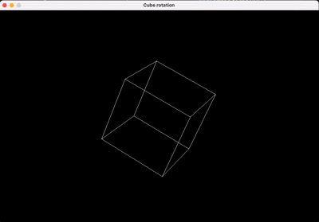

# SDL2 Rotating Cube in C

A program that renders a rotating 3‑D wireframe cube using **SDL2**. It demonstrates:

1. Basic 3‑D maths (Euler rotation → perspective projection).
2. Bresenham line drawing on an `SDL_Surface`.
3. Continuous animation with SDL’s event loop.

---

# Demo



## 1. Build Quick‑start

```bash
chmod +x build.sh
./build
```

Run:

```bash
./cube
```

---

## 2. High‑level Flow

1. **Init SDL** (`SDL_INIT_VIDEO`) → create window + surface.
2. **Main loop**: handle events, clear surface, rotate + project vertices, draw 12 edges, update surface, delay 16 ms (\~60 fps).
3. **Quit** cleanly when window is closed.

---

## 3. Data Structures

```c
struct Cube2D { int x, y; };               // 2‑D screen coordinates
int cube[8][3];                            // static 3‑D vertices (±1)
int edges[12][2];                          // 12 index pairs for the lines
```

---

## 4. Maths Details

### 4.1 Euler Rotation (`rotation()`)

```c
// order: X → Y → Z
float y1 = y*cosX - z*sinX;    // rotate around X
float z1 = y*sinX + z*cosX;
...
float x2 = x1*cosY + z1*sinY;  // rotate around Y
float z2 = -x1*sinY + z1*cosY;
...
*x_rot = x2*cosZ - y2*sinZ;    // rotate around Z
*y_rot = x2*sinZ + y2*cosZ;
```

Angles (`angleX`, `angleY`, `angleZ`) are incremented each frame to animate.

### 4.2 Perspective Projection (`project()`)

```c
scale = DISTANCE / (z + DISTANCE);
screen_factor = scale * (min(W,H)/2);
```

`DISTANCE` is the virtual camera distance from the projection plane (adjust to zoom). A `z_offset` of **+10** keeps the cube entirely in front of the camera so `z + DISTANCE` never hits zero.

---

## 5. Drawing Lines

A pure integer **Bresenham** (`DrawLine`) avoids `SDL_Renderer`. We write pixels directly to the surface:

```c
Uint32 *pixels = (Uint32*)surface->pixels;
pixels[y * surface->w + x] = color;
```

No locking needed because we fill the whole frame while the surface isn’t shown (`SDL_UpdateWindowSurface` swaps it afterwards).

---

## 6. Main Loop Annotated

```c
SDL_FillRect(surface, NULL, 0x000000);  // clear

// 1. Rotate + project all 8 vertices
for(i=0;i<8;i++) {
    rotation(...,&x_r,&y_r,&z_r, angleX,angleY,angleZ);
    project(x_r,y_r,z_r+z_offset,&x2D,&y2D);
    cube2D[i].x = (int)x2D;
    cube2D[i].y = (int)y2D;
}

// 2. Draw 12 edges
for(i=0;i<12;i++) {
    a=edges[i][0]; b=edges[i][1];
    DrawLine(surface,cube2D[a].x,cube2D[a].y, cube2D[b].x,cube2D[b].y, COLOR_WHITE);
}

// 3. Increment angles → animation
angleX += 0.01f; angleY += 0.02f; angleZ += 0.015f;

SDL_UpdateWindowSurface(win);
SDL_Delay(16);
```

Angles differ per axis for a nice tumbling effect.