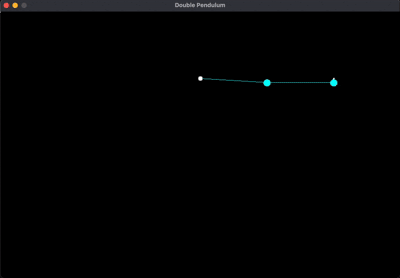

# Double Pendulum Simulation

This program simulates a double pendulum using physics equations and SDL2 for visualization, creating a mesmerizing chaotic system with a dynamic trail effect.

## Table of Contents
- [Program Overview](#program-overview)
- [Physics Simulation](#physics-simulation)
- [Visual Elements](#visual-elements)
- [Trail Effect](#trail-effect)
- [Dynamic Coloring](#dynamic-coloring)
- [Compilation and Execution](#compilation-and-execution)

# Demo



## Program Overview

The simulation features:
- A double pendulum system with two connected arms
- Realistic physics based on Lagrangian mechanics
- Fading trail showing the path of the second pendulum bob
- Color-coded visualization based on pendulum speed
- Energy damping to simulate real-world friction

## Physics Simulation

The pendulum is defined by:
```c
typedef struct {
    double theta1, theta2;  // Angles from vertical (radians)
    double omega1, omega2;  // Angular velocities
    double L1, L2;          // Arm lengths (pixels)
    double m1, m2;          // Bob masses
} DoublePendulum;
```

Key physics components:
- Equations of motion derived from Lagrangian mechanics
- Gravity constant (500 pixels/s² in this implementation)
- Damping factor (0.999) to simulate energy loss
- Time-step adjusted for smooth animation

Physics update loop:
```c
simulate(&dp, 500, dt);  // Update pendulum state
dp.omega1 *= damping;    // Apply damping
dp.omega2 *= damping;
```

## Visual Elements

1. **Pendulum Components**:
   - Origin point: White circle at top center
   - First bob: Circle at end of first arm
   - Second bob: Circle at end of second arm
   - Arms: Lines connecting the components

2. **Coordinate System**:
   - Origin fixed at (WIDTH/2, HEIGHT/4)
   - Y-axis increases downward (screen coordinates)

## Trail Effect

The second bob leaves a fading trail:
- Circular buffer stores last 4000 positions
- Older positions fade to black
- Implemented as small squares (3x3 pixels)
- Alpha value decreases with trail age

```c
trail[trail_index].x = (int)bob2.x;  // Store position
trail[trail_index].y = (int)bob2.y;
trail_index = (trail_index + 1) % TRAIL_LEN;  // Circular buffer
```

## Dynamic Coloring

The pendulum color changes based on speed:
- Blue: Slow movement
- Green: Medium speed
- Red: Fast movement
- White: Stationary positions

Color calculation:
```c
double speed = fabs(dp.omega2);
if (speed > 10) speed = 10;
int red = (int)(255.0 * (speed / 10.0));
int green = 255 - red;
Uint32 color_dynamic = SDL_MapRGB(surface->format, red, green, 255 - red);
```

## Compilation and Execution

### Dependencies
- SDL2 library
- C compiler (GCC recommended)
- Math library (-lm)

### Compilation (Linux)
```bash
gcc double_pendulum.c -o double_pendulum -lm $(sdl2-config --cflags --libs)
```

### Execution
```bash
./double_pendulum
```

### Controls
- Close the window to exit the program
- The simulation runs automatically with no user input required

The program demonstrates chaotic motion where small changes in initial conditions lead to dramatically different trajectories, creating a visually captivating display of physics in action.