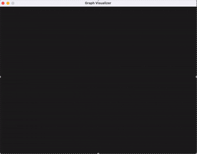

# Graph Visualizer with Bellman-Ford Algorithm

This program is an interactive graph visualizer that implements the Bellman-Ford algorithm to find the shortest path between nodes. It uses SDL2 for graphics and SDL_ttf for text rendering.

# Demo



---

# Key Features
1.	Interactive Graph Creation:
- Add nodes with right mouse click
- Create directional edges by holding Shift and left-clicking two nodes
- Drag nodes to reposition them
2.	Special Node Management:
- Set source node (green) using ‘S’ + click
- Set destination node (red) using ‘G’ + click
3.	Bellman-Ford Algorithm:
- Run the algorithm by pressing ‘B’
- Shortest path is visualized (blue)
- Detects negative cycles
- Displays edge weights
4.	Dijkstra Algorithm:
- Run the algorithm by pressing ‘D’
- Shortest path is visualized (blue)
- Displays edge weights
5.	Advanced Visualization:
- Directional arrows on edges
- Edge weights displayed
- Node IDs visible
- Visual feedback for path, source, and destination

---

# How to Use
1.	Creating Nodes:
- Right-click to add a new node
2.	Creating Edges:
- Hold Shift
- Click the source node
- Then click the destination node
- (An edge will be created with a random weight from 1 to 20)
3.	Setting Source/Destination:
- Press ‘S’ and click a node to set it as the source (green)
- Press ‘G’ and click a node to set it as the goal (red)
4.	Running Algorithms:
- Press ‘B’ to run the Bellman-Ford algorithm
- Press ‘D’ to run the Dijkstra algorithm
- The shortest path will be highlighted in blue
- The minimum distance will appear in the top-left corner
5.	Dragging Nodes:
- Click and drag to reposition nodes
- Edges will automatically update
6.	Error Handling:
- Negative cycles are detected and reported
- Unreachable destinations are indicated

---

# Implementation Details

## Data Structures
- Node: Represents a graph node with coordinates, ID, and source/goal flags
- Edge: Represents a directed edge with source/target nodes and a weight

## Bellman-Ford Algorithm
1.	Initialize distances (INFINITE except source = 0)
2.	Relax all edges |V|-1 times
3.	Check for negative weight cycles
4.	Reconstruct path from goal back to source

## Dijkstra Algorithm
1.	Initialize all distances to INFINITY (except the source node = 0).
2.	Use a priority queue to store nodes by their current shortest distance.
3.	Extract the node with the smallest distance that has not yet been visited.
4.	For each neighbor of this node:
    - If the current distance + edge weight is less than the recorded distance, update the distance and set the predecessor.
5.	Repeat until all reachable nodes are visited or the goal node is reached.
6.	Reconstruct the shortest path from the goal back to the source using the predecessor array.

## Visualization
- Nodes:
- Source: Green
- Goal: Red
- Path: Blue
- Default: Gray
- Edges:
- Path: Blue
- Default: Gray
- Weights: Yellow
- Text:
- Node IDs: White
- Edge Weights: Yellow
- Algorithm result: Top-left corner

---

## System Requirements
- SDL2
- SDL2_ttf
- A font file such as FreeSansBold.otf (or modify the path in code)

---

## Compilation and Execution
```bash
chmod +x build.sh
./build.sh
```

---

### Limitations
- Max 100 nodes
- Max 200 edges
- Fixed window size: 800x600 pixels