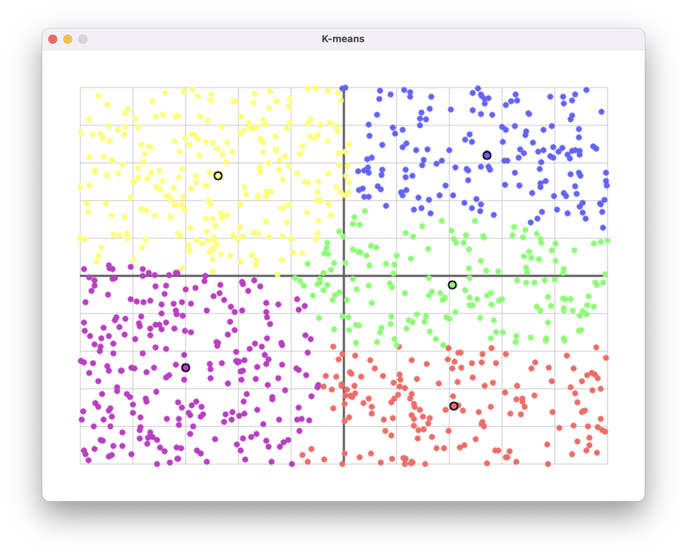
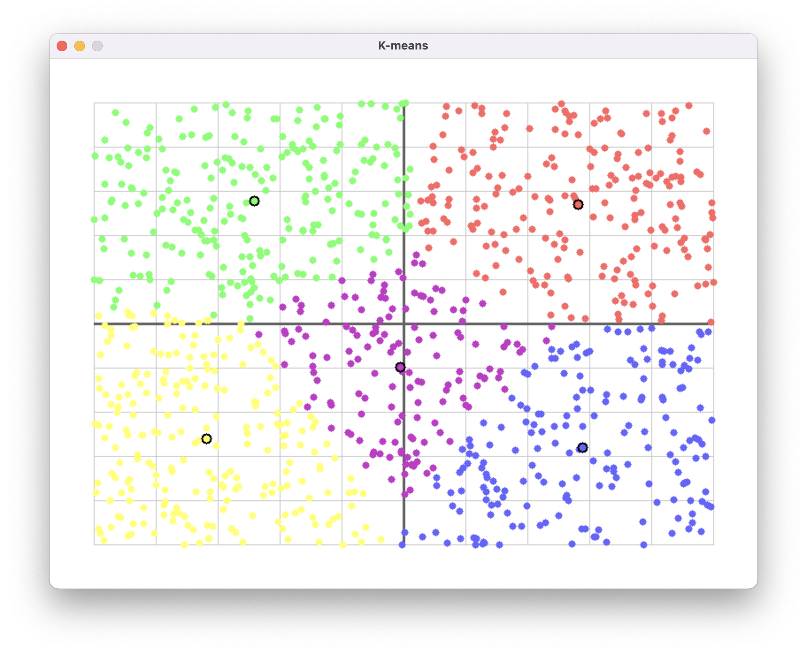

# K-means Clustering Visualizer

This project implements the K-means clustering algorithm in C and visualizes the results using the SDL2 library.

---




## Introduction to K-means

K-means is an iterative algorithm that aims to partition a dataset into K clusters. The main objective is to minimize the variance within each cluster, meaning that points in the same cluster are as similar as possible, while points in different clusters are as dissimilar as possible. K-means is widely used in data analysis, pattern recognition, and image processing due to its simplicity and effectiveness.

---

## K-means Algorithm

The K-means algorithm works through the following steps:

1. **Initialization**:
   - Randomly select K points from the dataset as the initial centroids of the clusters.
   
2. **Assignment**:
   - For each data point, calculate the Euclidean distance to each centroid.
   - Assign the point to the cluster with the nearest centroid.
   
3. **Update**:
   - Recalculate the position of each centroid by computing the mean of all points assigned to that cluster.
   
4. **Repeat**:
   - Repeat the assignment and update steps until the cluster assignments no longer change (convergence) or a maximum number of iterations is reached.

The algorithm minimizes the sum of squared distances between points and their respective centroids, effectively grouping similar points together.

---

## Code Overview

The code is written in C and uses the SDL2 library for graphical visualization.

### Data Structures
- **`Point`**:
  - Represents a data point with `x` and `y` coordinates (double) and a `cluster` field (int) indicating the cluster it belongs to.
- **`Centroid`**:
  - Represents a cluster centroid with `x` and `y` coordinates (double).

### Key Functions
- **`euclidean(Point point, Centroid centroid)`**:
  - Calculates the Euclidean distance between a point and a centroid using the formula:  
    `sqrt((point.x - centroid.x)^2 + (point.y - centroid.y)^2)`.
- **`normalize_points(Point data[], int n)`**:
  - Normalizes the coordinates of the points to a range of [0, 10] for both dimensions, scaling based on the minimum and maximum values in the dataset.
- **`kmeans(Point data[], int n, Centroid centroids[])`**:
  - Implements the K-means algorithm:
    1. Initializes centroids by randomly selecting K points from the dataset.
    2. Assigns each point to the nearest centroid.
    3. Updates the centroids by calculating the mean of the points in each cluster.
    4. Repeats until convergence or for a maximum of 100 iterations (`MAX_ITERS`).
- **`to_screen_coords(double x, double y, int *screen_x, int *screen_y)`**:
  - Converts normalized coordinates to screen coordinates (pixels) for visualization, accounting for window margins and size.
- **`draw_grid(SDL_Renderer *renderer)`**:
  - Draws a 10x10 background grid to help visualize the distribution of points.
- **`draw_point(SDL_Renderer *renderer, Point point)`**:
  - Draws a point as a colored circle, with the color determined by its cluster assignment.
- **`draw_centroid(SDL_Renderer *renderer, Centroid centroid, int cluster_id)`**:
  - Draws a centroid as a larger circle with a black border and a color corresponding to its cluster.
- **`load_points_from_file(const char *filename, Point *points)`**:
  - Loads points from a text file containing pairs of coordinates (x, y).

### Program Flow
1. **Load Data**:
   - Reads points from a file specified as a command-line argument.
2. **Normalize**:
   - Scales the points to the [0, 10] range for consistent visualization.
3. **Run K-means**:
   - Performs clustering with K=5 clusters.
4. **Visualize**:
   - Displays the points and centroids in an SDL2 window, allowing real-time observation of the clustering.

### Interaction
- Pressing the **'r'** key restarts the K-means algorithm with new random centroids, enabling users to observe different clustering configurations.
- Closing the window (clicking "X") exits the program.

---

## Usage Instructions

### Prerequisites
- A C compiler (e.g., `gcc`).
- The SDL2 library installed (e.g., `libsdl2-dev` on Debian/Ubuntu systems).

### Compilation
To compile the program, use the following command:

```bash
make
./kmeans input.txt
```