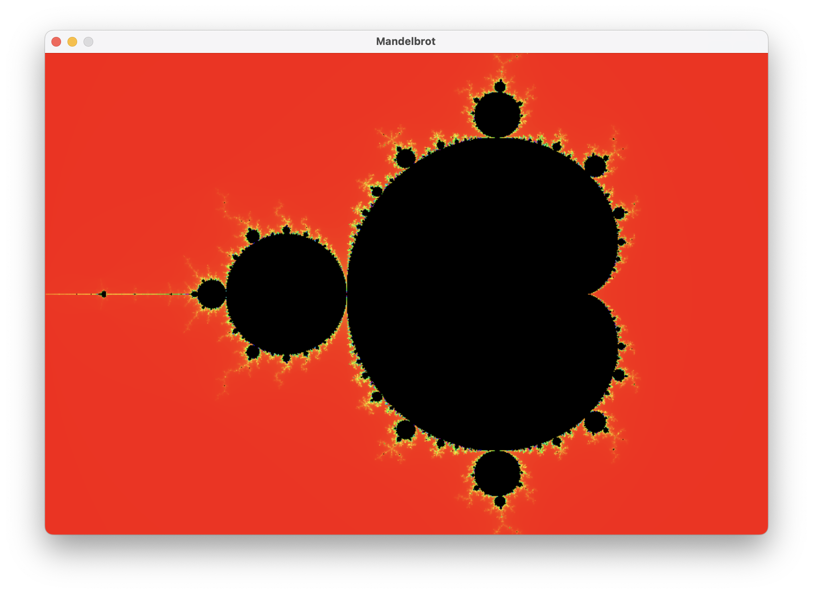

# Mandelbrot Viewer (SDL2, C)

Render the Mandelbrot set to an SDL window. The program computes the iteration count for each pixel and colors it using an HSV → RGB mapping.

---



## 1. Build Instructions

```bash
chmod +x build.sh
./build
./mandelbrot
```

---

## 2. High‑Level Algorithm

1. **For each pixel** `(x,y)` map to a point `c = real + i·imag` inside the complex plane rectangle `[-2.0,1.0] × [-1.0,1.0]` (or `[-2,1] × [-1,1]`).
2. Iterate `z_{n+1} = z_n^2 + c`, starting from `z_0 = 0`, until either:

   * `|z| > 2` (escapes) or
   * `iter == MAX_ITER` (assumed inside the set).
3. Use the number of iterations before escape to choose a **hue**; interior points become black.
4. Convert the hue (HSV) to RGB, plot the pixel.

The process repeats every frame (in the sample you provided), but since there is no interaction you could compute once and reuse.

---

## 3. Source Walkthrough

### 3.1 Includes & Defines

```c
#include <stdio.h>
#include <SDL2/SDL.h>
#include <complex.h>

#define WIDTH 900
#define HEIGHT 600
#define MAX_ITER 500
```

* `<complex.h>` gives native complex type & functions (`double _Complex`, `cabs`, `cpow`).
* `MAX_ITER` sets escape depth; higher yields more detail but more CPU time.

### 3.2 HSV → RGB Helper (Declared Early, Explained Later)

```c
void hsv_to_rgb(float h, float s, float v, Uint8 *r, Uint8 *g, Uint8 *b) { /* ... */ }
```

Keeps color math separated from fractal logic.

### 3.3 Pixel Iteration / Rendering

```c
void visualize_mandelbrot(SDL_Surface *surface) {
    const double re_min = -2.0, re_max = 1.0;
    const double im_min = -1.0, im_max = 1.0;

    for (int x = 0; x < WIDTH; x++) {
        for (int y = 0; y < HEIGHT; y++) {
            double real = re_min + x * (re_max - re_min) / WIDTH;
            double imag = im_max - y * (im_max - im_min) / HEIGHT;
            double _Complex z = 0;
            double _Complex c = real + imag * I;

            int iter = 0;
            while (iter < MAX_ITER && cabs(z) <= 2.0) {
                z = cpow(z, 2) + c; // z = z^2 + c
                iter++;
            }
            // Color mapping happens inline (see Section 5)
            // ...
        }
    }
}
```

* Mapping `imag`: we invert Y (`im_max - ...`) so the mathematical positive imaginary axis points **up** on screen.
* Escape radius 2 is mathematically sufficient for Mandelbrot (if |z| ever exceeds 2 it will diverge to infinity).

### 3.4 Main Setup Loop

```c
SDL_Init(SDL_INIT_VIDEO);
SDL_Window *win = SDL_CreateWindow("Mandelbrot", ...);
SDL_Surface *surf = SDL_GetWindowSurface(win);

while (running) {
    while (SDL_PollEvent(&e)) if (e.type == SDL_QUIT) running = 0;
    visualize_mandelbrot(surf);
    SDL_UpdateWindowSurface(win);
}
```

* A simple pump loop; there is no timing control—CPU will run full tilt. You can add `SDL_Delay(1)` or precompute once.

### 3.5 Performance Notes

* Using `cpow(z,2)` is more expensive than inlining `z*z`. Replace with manual operations for speed: `z = z*z + c;` works because operator overloading applies to complex numbers.
* You redraw the full set each frame. If static, call `visualize_mandelbrot` **once** before the loop, then only poll events.
* Direct pixel access (locking the surface, writing raw bytes) would be faster than per‑pixel `SDL_FillRect` calls. Current code uses a 1×1 rect fill which is simple but slower.

---


## 4. **Coloring**

### 4.1 Escape Iteration → Hue

For escaped points (`iter < MAX_ITER`):

```c
float hue = (360.0f * iter) / MAX_ITER; // 0° ... 360°
```

This gives a linear gradient through the hue circle. Saturation and value are fixed at 1.0 for fully vivid colors.

### 4.2 HSV to RGB Conversion

The helper converts hue (degrees) + saturation + value into 0–255 RGB:

```c
float c = v * s;
float x = c * (1 - fabsf(fmodf(h / 60.0f, 2) - 1));
float m = v - c;
// pick (rp,gp,bp) from one of six sectors
// add m to shift from [0,c] to [m, m+c]
*r = (Uint8)((rp + m) * 255);
*g = (Uint8)((gp + m) * 255);
*b = (Uint8)((bp + m) * 255);
```

* `c` = chroma (color intensity).
* `x` = second largest component (depends on sector of hue).
* `m` adds the same offset to bring the minimum component to the desired brightness (value `v`).

### 4.3 Inside the Set

If a point never escaped after `MAX_ITER` iterations we treat it as **inside** and color it solid black:

```c
if (iter == MAX_ITER) { r = g = b = 0; }
```

You could use a different scheme (e.g. deep blue) or do smooth interior shading, but black is conventional.

### 4.4 Integrating the Color Mapping

Within the pixel loops:

```c
Uint8 r,g,b;
if (iter == MAX_ITER) {
    r = g = b = 0;
} else {
    float hue = 360.0f * (float)iter / (float)MAX_ITER;
    hsv_to_rgb(hue, 1.0f, 1.0f, &r, &g, &b);
}
Uint32 color = SDL_MapRGB(surface->format, r, g, b);
SDL_Rect pixel = { x, y, 1, 1 };
SDL_FillRect(surface, &pixel, color);
```

### 4.5 Alternative Palettes (Quick Examples)

| Palette Idea          | Formula (hue/value change)                                          |
| --------------------- | ------------------------------------------------------------------- |
| Blue flames           | `hue = 240 - 240 * iter / MAX_ITER;`                                |
| Rainbow loop twice    | `hue = 720 * iter / MAX_ITER;` (mod 360)                            |
| Desaturate with depth | `s = iter / (float)MAX_ITER;`                                       |
| Log hue               | `hue = 360 * log(iter+1)/log(MAX_ITER);`                            |
| Smooth (continuous)   | Use fractional iteration `nu` then map `hue = 360 * nu / MAX_ITER;` |

### 4.6 Continuous (Smooth) Coloring (Formula)

After escape at iteration `iter` with magnitude `|z|` (call it `r`):

```c
float mu = iter + 1 - log2f(logf(r));
float hue = 360.0f * mu / MAX_ITER;
```

This removes banding artifacts.