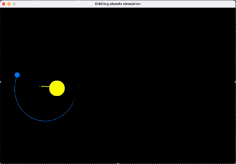

# Two-Body Orbit Simulation (SDL2, C)

This program simulates a two‑body gravitational interaction and renders it with **SDL2**. A small planet (blue) orbits a more massive body (yellow). A trail records past positions.

---

# Demo



## 1. High‑Level Overview

**Goal:** Integrate Newtonian gravity for two bodies and visualize motion.

**Core Steps per Frame:**

1. Compute frame `dt` (seconds) from SDL ticks.
2. Apply mutual gravitational acceleration (function misnamed `calculate_distance`).
3. Update velocity & position (explicit Euler inside that function).
4. Append current positions to the `trail` ring buffer.
5. Clear screen; draw trail and both planets.
6. Present frame.

## 2. Constants & Definitions

```c
#define G 10000          // Scaled gravitational constant
#define EPSILON 1e-1     // Softening term added inside sqrt to avoid /0
#define MAX_TRAIL_POINTS 500
```

*G* is an arbitrary scale factor to produce an orbital period that “looks” nice given pixel units and dt \~ 16 ms.

`EPSILON` is added (inside the distance computation) to prevent explosion when bodies coincide (it effectively softens the potential very slightly).

`MAX_TRAIL_POINTS` bounds trail memory & draw cost.

---

## 3. Data Structures

```c
struct Point { int x1,y1,x2,y2; };      // Each stores endpoints (currently: planet1 & planet2 positions)
struct Planet { double x,y,r,vx,vy,mass; };
```

**Note:** The trail stores *two* pixels per element (one for each body). If you only need the small planet’s path, you can simplify to a single (x,y) pair.

---

## 4. Drawing Primitives

### 4.1 `FillCircle`

Brute‑force pixel fill over bounding square; test `dx*dx + dy*dy <= r^2`. This is O(r^2) per circle. For many larger circles you’d want a midpoint circle algorithm or use `SDL_Renderer` with textures.

### 4.2 Trail Drawing

A simple loop draws 2×2 rectangles for each stored position for both bodies. No fading: all trail points have equal intensity.

---

## 5. Physics Function

### 5.1 `calculate_distance`

Despite its name, it: (a) computes distance and force, (b) updates both bodies.

```c
double dx = p2->x - p1->x;
double dy = p2->y - p1->y;
double r = sqrt(dx*dx + dy*dy + EPSILON);

double F = (G * p1->mass * p2->mass) / (r * r);

// Accelerations (vector form: a = F/m * (direction))
double ax1 = F * dx / r / p1->mass;
...
// Update velocities then positions (Euler)
p1->vx += ax1 * dt; ...
p1->x  += p1->vx * dt; ...
```

**Softening:** The epsilon is inside the sqrt, so effectively `r = sqrt(r^2 + eps)` then reused in `F/(r*r)`. This slightly reduces force at very small distances.

**Physics Accuracy:** Explicit Euler updates `v` then updates `x` using the *new* velocity. True Euler would use old velocity for the position update; this variant is semi‑implicit (a.k.a. symplectic Euler). Good news: semi‑implicit Euler is *more* stable for orbits than standard (explicit) Euler, though still diffusive vs Verlet.

---

## 6. Initial Conditions

```c
struct Planet planet2 = { WIDTH/6.0, HEIGHT/2.0, 30.0, 20.0, 0.0, 300.0 };
struct Planet planet1 = { planet2.x + 150.0, planet2.y, 10.0, 0.0, 0.0, 5.0 };
...
double speed = sqrt(G * planet2.mass / distance);  // Circular orbit approximation
planet1.vx = -dy/distance * speed;  // dy==0 ⇒ vx=0
planet1.vy =  dx/distance * speed;  // dx>0 ⇒ vy>0
```

Because `dy=0`, you set `planet1.vx=0`, `planet1.vy=+speed`. This yields an initial tangential velocity for a (nearly) circular orbit *in the frame where the heavy body is at rest*. But you also give `planet2.vx = 20.0`, so the entire system drifts right. If you want the barycenter stationary, set the heavy body’s velocity to:

```
planet2.vx = -(planet1.mass / planet2.mass) * planet1.vy;  // perpendicular direction
planet2.vy = 0;
```

---

## 7. Time Step & Main Loop

```c
double dt = (now - prev_ticks) / 1000.0;  // seconds
```

Frame‑rate dependent. With vsync fluctuations you get variable dt, causing minor energy variation. For more consistent physics you can:

1. Accumulate real elapsed time.
2. Step the physics at fixed Δt (e.g. 1/120 s) in a while loop.
3. Render once per frame.

---

## 8. Trail Management

A fixed array acts like a FIFO. When full, elements shift left O(N). For `MAX_TRAIL_POINTS=500` this is fine. For larger trails prefer a circular buffer index (`head = (head+1)%N`).