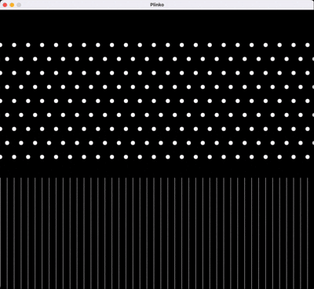

# Plinko

This program simulates a Plinko board game using SDL2, where balls fall through a grid of obstacles and land in slots at the bottom.

## Table of Contents
- [Program Overview](#program-overview)
- [Physics Simulation](#physics-simulation)
- [Collision System](#collision-system)
- [Rendering](#rendering)
- [User Interaction](#user-interaction)
- [Compilation and Execution](#compilation-and-execution)

# Demo




## Program Overview

The simulation features:
- Balls that fall under gravity
- A grid of fixed obstacles (pins)
- A slotted board at the bottom
- Physics-based collisions
- Two spawning modes:
  - Manual: Click and hold to spawn balls
  - Automatic: 200 balls spawn automatically at the top

## Physics Simulation

Key physics components:
- **Gravity**: Constant downward acceleration (`GRAVITY = 800.0`)
- **Velocity**: Each ball maintains `vx` (horizontal) and `vy` (vertical) velocities
- **Resting State**: Balls "snap" in place when velocities drop below threshold
- **Friction**: Horizontal friction applied when balls hit the floor

Physics update loop:
```c
apply_gravity(&circles, dt);
for (int iter = 0; iter < circles.used / 2; iter++) {
    resolve_walls_and_floor(&circles);
    check_obstacle_collisions(&circles, &obstacles);
    check_line_collisions(&circles);
    resolve_ball_ball_collisions(&circles);
}
```

## Collision System

### 1. Wall and Floor Collisions
- **Floor**: Balls stop vertical movement and experience friction
- **Walls**: Perfectly elastic collisions with restitution (`REST_SIDE = 0.7`)

### 2. Ball-Ball Collisions
- Momentum-conserving collisions
- Mass-based response (stationary balls have higher mass)
- Restitution coefficient: `REST_BALL = 0.6`

### 3. Obstacle Collisions
- Grid of circular pins arranged in staggered pattern
- Elastic collisions when balls hit pins

### 4. Slot Collisions
- Vertical lines at bottom form slots
- Special collision detection for line segments
- Horizontal velocity reversal on impact

## Rendering

Visual elements:
1. **Balls**: White filled circles (`FillCircle()`)
2. **Obstacles**: Grid of white circles
3. **Slot**: Vertical white lines at bottom (`draw_slot()`)

Rendering pipeline:
```c
SDL_FillRect(surface, NULL, COLOR_BLACK);  // Clear screen
draw_obstacles(surface, &obstacles);      // Draw pins
draw_slot(surface);                       // Draw bottom slots
for (each ball) {
    FillCircle(surface, ball, COLOR_WHITE); // Draw balls
}
SDL_UpdateWindowSurface(window);          // Refresh display
```

## User Interaction

- **Mouse Click**: Spawn single ball at cursor position
- **Mouse Hold**: Continuously spawn balls (0.06s interval)
- **Automatic Mode**: 200 balls spawn from top at 0.15s intervals
- **Close Window**: Exit program

## Compilation and Execution

### Dependencies
- SDL2 library
- C compiler (GCC recommended)

### Compilation
```bash
chmod +x build.sh
./build
```

### Execution
```bash
./plinko
```

### Controls
- Click and hold mouse: Spawn balls at cursor
- Automatic mode: Starts immediately (200 balls from top)
- Close window: Exit program

The simulation demonstrates realistic physics interactions between balls, obstacles, and boundaries, creating an engaging Plinko game experience.