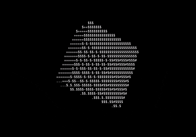

# ASCII Rotating Cube

A program that renders a spinning 3‑D cube **inside your terminal** using ASCII characters. It:

* Rotates cube vertices with Euler angles (`rotA`, `rotB`, `rotC`).
* Projects them to 2‑D with a simple perspective formula.
* Uses a per-character **z‑buffer** (`depthBuf`) so nearer fragments overwrite farther ones.
* Prints the whole frame at once using ANSI escape codes for flicker-free animation.

---

# Demo



## 1. Build & Run

### Linux / macOS

```bash
cc terminal_cube.c -lm -o terminal_cube
./terminal_cube
```

* `-lm` links against the math library (`sin`, `cos`).
* Make sure your terminal is at least **160×44** characters (or adjust `screenW`/`screenH`).

### Windows

* Use MSYS2/MinGW or WSL to build:

  ```bash
  gcc terminal_cube.c -lm -o terminal_cube.exe
  ./terminal_cube.exe
  ```
* The program uses ANSI escape sequences (`"\x1b[H"`, `"\x1b[2J"`). Ensure your terminal supports them (Windows Terminal, PowerShell with VT sequences enabled, etc.).

Press **Ctrl‑C** to quit.

---

## 2. High-Level Flow

1. **Clear screen once** (`"\x1b[2J"`).
2. **Each frame**:

   * Zero the depth buffer and fill the character buffer with background spaces.
   * Sample all six faces of the cube (nested loops over `sx`, `sy`).
   * Rotate → project → depth-test each sample point, writing an ASCII char if it’s the closest so far.
   * Move cursor to top-left (`"\x1b[H"`) and print the buffer row by row.
   * Increment rotation angles a bit; sleep briefly.

---

## 3. Important Constants & Buffers

```c
int screenW = 160, screenH = 44;   // Terminal "resolution" in characters
float depthBuf[160 * 44];          // Stores 1/z for each cell (bigger = closer)
char  asciiBuf[160 * 44];          // Stores the char to display per cell
int   bgChar = ' ';                // Background fill character

int   halfCube = 10;               // Cube semi-size → cube spans [-10, +10]
float step     = 0.6f;             // Sampling step along each face
int   camDistance = 60;            // Camera offset along +Z (keeps cube in front)
float scaleFactor = 40.0f;         // Overall perspective scale
```

* **`depthBuf`**: initialized to 0 each frame. We store `1/z` (closer => larger), so we keep the maximum.
* **`asciiBuf`**: initialized to spaces each frame and then overwritten when a closer point is found.
* **`step`** controls how densely we sample the faces. Smaller step = smoother, slower.

---

## 4. Rotation Math

Three helpers compute the rotated coordinates of a point `(i, j, k)`:

```c
float rotatedX(int i, int j, int k) { ... }
float rotatedY(int i, int j, int k) { ... }
float rotatedZ(int i, int j, int k) { ... }
```

They are the expanded form of `Rz(rotC) * Ry(rotB) * Rx(rotA)` multiplied by the vector `(i, j, k)`.

* `rotA`, `rotB`, `rotC` are global angles. In the main loop only `rotA` and `rotB` are increased, but you can animate `rotC` too.

Example (truncated):

```c
return j * sin(rotA) * sin(rotB) * cos(rotC)
     - k * cos(rotA) * sin(rotB) * cos(rotC)
     + j * cos(rotA) * sin(rotC)
     + k * sin(rotA) * sin(rotC)
     + i * cos(rotB) * cos(rotC);
```

---

## 5. Projection & Z‑Buffer Test

Performed in `plotSurfacePoint()`:

```c
rz = rotatedZ(...) + camDistance;   // push cube forward so z>0
invZ = 1.0f / rz;                   // store 1/z for both scale & depth test
xProj = (int)(screenW/2 + scaleFactor * invZ * rx * 2);
yProj = (int)(screenH/2 + scaleFactor * invZ * ry);
```

* Note the `*2` on X to compensate for character aspect ratio (chars are taller than wide).
* Index into the buffers: `index = xProj + yProj * screenW`.
* If `invZ > depthBuf[index]`, overwrite `depthBuf[index]` and draw the new char.

---

## 6. Sampling the Six Faces

Inside the nested loops over `sx` and `sy`, each face is represented by fixing one coordinate to `±halfCube`:

```c
plotSurfacePoint(sx, sy, -halfCube, '.');  // front  (z = -halfCube)
plotSurfacePoint(sx, sy,  halfCube, '$');  // back   (z = +halfCube)
plotSurfacePoint(sx, -halfCube, sy, '+');  // bottom (y = -halfCube)
plotSurfacePoint(sx,  halfCube, sy, '#');  // top    (y = +halfCube)
plotSurfacePoint( halfCube, sx, sy, '$');  // right  (x = +halfCube)
plotSurfacePoint(-halfCube, sx, sy, '-');  // left   (x = -halfCube)
```

Different ASCII chars can help distinguish faces. Replace them with a depth‑based gradient for pseudo‑lighting.

---

## 7. Terminal Output

```c
printf("\x1b[2J"); // clear once
while (1) {
    memset(depthBuf, 0, screenW*screenH*sizeof(float));
    memset(asciiBuf, bgChar, screenW*screenH);
    ... // draw cube
    printf("\x1b[H"); // cursor home
    for (int k = 0; k < screenW*screenH; k++)
        putchar(k % screenW ? asciiBuf[k] : '\n');
    rotA += 0.005f; rotB += 0.005f;
    usleep(1000);
}
```

* `\x1b[H` moves the cursor to (1,1) each frame so we redraw over the old frame.
* Printing the whole buffer at once prevents flicker.
* `usleep(1000)` ≈ 1 ms sleep; tweak to control speed / CPU load.

---

## 8. Minimal Core (Cheat Sheet)

```c
// rotate point
rx = rotatedX(i,j,k); ry = rotatedY(i,j,k); rz = rotatedZ(i,j,k) + camDistance;
invZ = 1.0f / rz;
// project
xProj = cx + scaleFactor * invZ * rx * 2;
yProj = cy + scaleFactor * invZ * ry;
// z-buffer test
idx = xProj + yProj * screenW;
if (invZ > depthBuf[idx]) { depthBuf[idx]=invZ; asciiBuf[idx]=ch; }
```