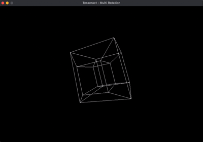

# Tesseract Visualization with SDL2

This program visualizes a rotating tesseract (a 4D hypercube) using the SDL2 library in C. It renders the tesseract by rotating it in 4D space, projecting it to 3D, and then to 2D for display on a screen. Users can switch between different rotation modes using keyboard inputs to explore the tesseract's structure from various perspectives.



## Introduction

A tesseract is the four-dimensional equivalent of a cube. While a cube has six square faces, a tesseract has eight cubic "cells." Since humans cannot directly perceive 4D space, this program simulates the tesseract by projecting its 4D geometry onto a 2D screen. The tesseract rotates continuously, and users can control which planes of rotation are active, providing insight into its complex structure.

## Key Concepts

### 4D Space and the Tesseract

- **4D Space**: Points in 4D space are defined by four coordinates: `x`, `y`, `z`, and `w`.
- **Tesseract**: A tesseract has 16 vertices, formed by all combinations of ±1 across its four dimensions (e.g., (-1, -1, -1, -1), (1, -1, -1, -1), etc.). It has 32 edges connecting these vertices.

### Rotation in 4D

In 4D space, rotations occur across pairs of dimensions, known as planes. The program supports six rotation planes:
- **XY**: Rotates between the x and y axes.
- **XZ**: Rotates between the x and z axes.
- **XW**: Rotates between the x and w axes.
- **YZ**: Rotates between the y and z axes.
- **YW**: Rotates between the y and w axes.
- **ZW**: Rotates between the z and w axes.

Each rotation is implemented using trigonometric functions (`cos` and `sin`) to transform the coordinates in the specified plane.

### Projection

To display the tesseract:
- **4D to 3D**: A perspective projection reduces the 4D coordinates (`x`, `y`, `z`, `w`) to 3D (`x`, `y`, `z`) based on the `w` coordinate and a viewer distance (`DISTANCE_4D`).
- **3D to 2D**: Another perspective projection maps the 3D coordinates to 2D screen coordinates (`x`, `y`) using a viewer distance (`DISTANCE_3D`) and a scaling factor (`SCALE`).

### User Controls

The program allows interactive control via the keyboard:
- **ESC**: Exits the program.
- **0**: Enables all six rotations simultaneously, each at different speeds.
- **1**: Rotates only in the XY plane.
- **2**: Rotates only in the XZ plane.
- **3**: Rotates only in the XW plane.
- **4**: Rotates only in the YZ plane.
- **5**: Rotates only in the YW plane.
- **6**: Rotates only in the ZW plane.

## Code Structure

### Headers and Definitions

- **Headers**: 
  - `<SDL2/SDL.h>`: For graphics rendering.
  - `<stdio.h>`: For error messages and console output.
  - `<math.h>`: For trigonometric functions.
- **Constants**:
  - `WIDTH` (900): Window width in pixels.
  - `HEIGHT` (600): Window height in pixels.
  - `SCALE` (1000): Scaling factor for projection.
  - `DISTANCE_4D` (3.0): Distance from the viewer to the 4D space.
  - `DISTANCE_3D` (5.0): Distance from the viewer to the 3D space.

### Data Structures

- **`Vec4`**: Represents a 4D point with `x`, `y`, `z`, and `w` (floats).
- **`Vec3`**: Represents a 3D point with `x`, `y`, and `z` (floats).
- **`Vec2`**: Represents a 2D point with `x` and `y` (floats).

### Rotation Functions

Each function rotates a `Vec4` point around a specific plane by an angle:
- **`rotate_xy`**: Rotates in the XY plane.
- **`rotate_xz`**: Rotates in the XZ plane.
- **`rotate_xw`**: Rotates in the XW plane.
- **`rotate_yz`**: Rotates in the YZ plane.
- **`rotate_yw`**: Rotates in the YW plane.
- **`rotate_zw`**: Rotates in the ZW plane.

For example, in `rotate_xy`:
```c
float x = v->x, y = v->y;
v->x = x * cosf(angle) - y * sinf(angle);
v->y = x * sinf(angle) + y * cosf(angle);
```
This applies a standard 2D rotation matrix to the `x` and `y` coordinates.

### Projection Functions

- **`project_4D_to_3D`**:
  - Takes a `Vec4` and projects it to a `Vec3`.
  - Formula: `(x * w_factor, y * w_factor, z * w_factor)`, where `w_factor = 1 / (DISTANCE_4D - w)`.
  - Avoids division by zero by clamping the denominator.

- **`project_3D_to_2D`**:
  - Takes a `Vec3` and projects it to a `Vec2`.
  - Formula: `(x * z_factor * SCALE + WIDTH/2, y * z_factor * SCALE + HEIGHT/2)`, where `z_factor = 1 / (DISTANCE_3D - z)`.
  - Centers the projection on the screen.

### Main Function

The `main` function orchestrates the visualization:

1. **SDL Initialization**:
   - Initializes SDL, creates a 900x600 window titled "Tesseract - Multi Rotation," and sets up an accelerated renderer.

2. **Vertex Generation**:
   - Creates an array of 16 `Vec4` vertices.
   - Uses bitwise operations to assign ±1 to each coordinate based on the vertex index (0 to 15):
     ```c
     vertices[i].x = (i & 1) ? 1 : -1;
     vertices[i].y = (i & 2) ? 1 : -1;
     vertices[i].z = (i & 4) ? 1 : -1;
     vertices[i].w = (i & 8) ? 1 : -1;
     ```

3. **Main Loop**:
   - **Event Handling**:
     - Polls SDL events to handle quitting (ESC or window close) and key presses (0-6 for rotation modes).
     - Prints the current mode to the console.
   - **Rotation**:
     - Copies the original vertices to a `rotated` array.
     - Applies rotations based on `rotation_mode`:
       - Mode 0: All rotations with varying speeds (e.g., `angle * 0.7`, `angle * 0.3`).
       - Modes 1-6: A single rotation in the corresponding plane.
   - **Projection**:
     - Projects each rotated `Vec4` to `Vec3`, then to `Vec2`, storing results in a `projected` array.
   - **Drawing**:
     - Clears the screen to black.
     - Sets the draw color to white.
     - Draws lines between vertices if their indices differ by exactly one bit (using `__builtin_popcount(i ^ j) == 1`), indicating a single coordinate difference (an edge).
   - **Update**:
     - Presents the rendered frame.
     - Delays for ~16 ms (targeting 60 FPS).
     - Increments `angle` by 0.01 radians per frame.

4. **Cleanup**:
   - Destroys the renderer and window, then quits SDL.

## Compilation and Running

### Prerequisites
- Install SDL2

### Compilation
Compile with `gcc`, linking SDL2 and the math library:
```bash
make
```

### Running
Run the executable:
```bash
./tesseract
```