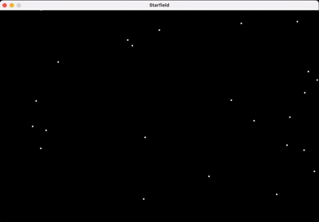

# Starfield Warp Effect (SDL2, C)

This program produces a **“flying through stars”** illusion: white squares spawn at random positions and accelerate radially away from screen centre, giving the impression of moving forward at warp speed.

---

# Demo 



## 1. Build & Run

### macOS (Homebrew)

```bash
clang starfield.c -I"$(brew --prefix)/include" -L"$(brew --prefix)/lib" -lSDL2 -o starfield
./starfield
```

### Debian / Ubuntu

```bash
sudo apt install libsdl2-dev
cc starfield.c -lSDL2 -o starfield
./starfield
```

### Windows (MSYS2 MinGW64)

```bash
pacman -S mingw-w64-x86_64-SDL2
x86_64-w64-mingw32-gcc starfield.c -lSDL2 -o starfield.exe
starfield.exe
```

---

## 2. Constants & Data Structures

| Constant / struct | Purpose                                       |
| ----------------- | --------------------------------------------- |
| `WIDTH`, `HEIGHT` | Window size (900 × 600 px)                    |
| `MAX_POINTS`      | Max stars kept alive simultaneously (200)     |
| `struct Point`    | Holds integer `x,y` pixel coords for one star |
| `COLOR_*` macros  | ARGB hex literals for SDL                     |

The star array is a **ring buffer** of size `MAX_POINTS`; when full, the oldest element is overwritten.

---

## 3. Core Functions

### 3.1 `calculate_rect`

```c
void calculate_rect(struct Point *p, double dt) {
    struct Point centre = { WIDTH/2, HEIGHT/2 };
    struct Point v = { p->x - centre.x, p->y - centre.y };
    p->x += dt * v.x;
    p->y += dt * v.y;
}
```

* Calculates a radial velocity **v = position − centre**.
* Moves the point by `v·dt` (Euler integration). Hence stars farther away move faster → perspective.

### 3.2 Main Loop Highlights

```c
Uint32 now = SDL_GetTicks();
double dt  = (now - prev_ticks) / 1000.0;
prev_ticks = now;
```

`dt` (seconds) is frame‑time, giving time‑independent motion.

```c
// spawn random star each frame
int rx = rand() % WIDTH;
int ry = rand() % HEIGHT;
```

A new star is born every frame at random coordinates. If the buffer is full, all entries shift left (**O(n)** but with only 200 items it’s trivial).

```c
SDL_FillRect(surface, NULL, COLOR_BLACK); // clear
```

Clears entire back‑buffer each frame → no trails.

```c
SDL_Rect p = { points[i].x, points[i].y, 4, 4 };
SDL_FillRect(surface, &p, COLOR_WHITE);
```

Each star is a 4 × 4 pixel square for visibility.

---

## 4. Execution Flow

1. **Initialisation**: `SDL_Init(SDL_INIT_VIDEO)` → window + surface.
2. **Main loop** until `SDL_QUIT`:

   1. Compute `dt`.
   2. Poll events.
   3. **Spawn** one random star.
   4. **Update** every stored star with `calculate_rect`.
   5. Clear screen & draw stars.
   6. `SDL_UpdateWindowSurface` & `SDL_Delay(16)` (\~60 fps cap).
3. **Cleanup**: destroy window, `SDL_Quit`.